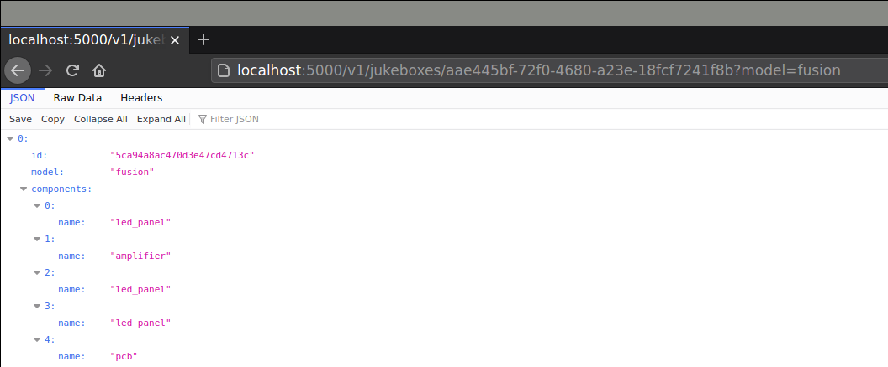

# Hazzard

[](http://travis-ci.org/mramshaw/Hazzard)
[](http://github.com/mramshaw/Hazzard/releases)

[](https://snyk.io//test/github/mramshaw/Hazzard?style=plastic&targetFile=package.json)

A simple RESTful endpoint with __node.js__ using [express](http://www.npmjs.com/package/express) and [superagent](http://www.npmjs.com/package/superagent).

Testing will be carried out with [Mocha](http://mochajs.org/), [Chai](http://chaijs.com) and [Chai-HTTP](http://www.chaijs.com/plugins/chai-http/).

Logging will be carried out with [morgan](http://www.npmjs.com/package/morgan).

## Configuration defaults

By default the app will run on `localhost` port `5000`, but other values may be specified as follows:

```bash
export HOST=127.0.0.1
```

Or:

```bash
export PORT=3333
```

## Linting

Code linting will be carried out with [ESLint](https://eslint.org/).

Lint the code as follows:

```bash
npm run -s eslint .
```

## Testing

Test the app as follows:

```bash
npm test
```

This should look as follows:


Or start the app (<kbd>npm start</kbd>) and test with [curl](CURLs.txt).

## Running

Start the app as follows:

```bash
npm start
```

This should make our endpoint available at:

    http://localhost:5000/v1/jukeboxes/

As usual, Ctrl-C to stop.

In a browser, this should look something like the following:



## Docker

We will use the LTS version (10.16.2-stretch) of node for our Docker build and tests.

Running <kbd>docker-compose up</kbd> will trigger a docker build and start the app.

[Ctrl-C and <kbd>docker-compose down</kbd> to stop.]

This should look as follows:


After the build has been done, run the docker image as follows:

```bash
docker run --rm -it -e HOST=0.0.0.0 -p 5000:5000 mramshaw4docs/jukeboxes:12.16.2-stretch
```

This should look as follows:


## To Do

- [x] Add various badges
- [x] Dockerize everything
- [x] Upgrade to latest LTS version of `node` (12.16.2-stretch)
- [x] Update dependencies to allow for reported exploits
- [ ] Add code coverage
- [ ] Create an integration with `swagger-ui` (for exploring the API)
